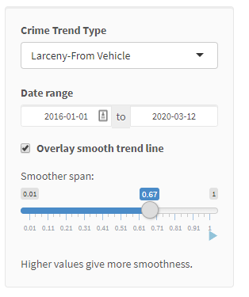
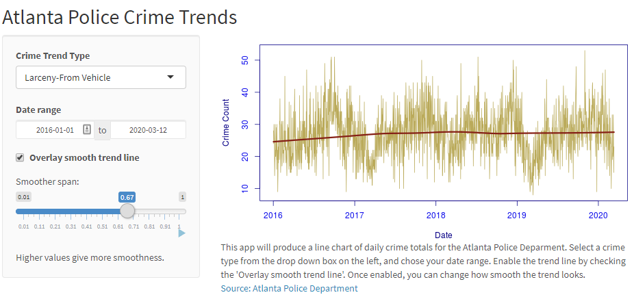

Atlanta Police Crime Data Shiny App
========================================================
author: John Moses
date: 3/25/2020
width: 1600
height: 700
font-import: https://fonts.googleapis.com/css?family=Open+Sans+Condensed
font-family: 'Open Sans Condensed', sans-serif

App Description
========================================================

<small>This Shiny app [(link)](https://zekephoenix.shinyapps.io/AtlantaPoliceCrimeTrends/) uses crime data [(source link)](https://www.atlantapd.org/i-want-to/crime-data-downloads) from the Atlanta Police Department's website and makes a daily line chart base on the type of crime selected.</small>

<small>The [Atlanta Police Department](https://www.atlantapd.org/home) is located in [Atlanta, Georgia](https://en.wikipedia.org/wiki/Atlanta) in the United States. </small>

<small>The selectors on the app do three things:
- select crime type
- select date range 
- enable optioal overlay for a smooth line curve for the data</small>

***




Slide With Code
========================================================
left: 70%
Below is a snippet of code that the shiny app runs. 

```r
library(dplyr)
library(readr)
library(lubridate)
# Load data
trend_data <- read_csv("data.csv")
names(trend_data) <- c("date","type","count")

# define plot colors
color = "#000088"
color1 = "#BBAA55"
color2 = "#0011EE"

#Filter for selected crime trend
selected_trends <- trend_data %>% filter( type == 'Robbery',
                date > as.POSIXct('2016-01-01') & date < as.POSIXct('2020-03-01') 
                )
```

***

- <small>The  ` type == 'Robbery' ` filter would be selected in the 'Crime Trend Type' drop-down selector</small>

- <small>The  ` date > as.POSIXct('2016-01-01') & date < as.POSIXct('2020-03-01') ` filter would be selected in the 'Date Range' selector</small>

Slide With Plot
========================================================
left: 30%
Below is the code and output plot of the data selected above. This would be the output of the Shiny app based on the selection of __Crime Trend Type__ "Robbery", and __Dates__ between "2016-01-01" and "2020-03-01."

This also shows the smoother line enabled.

***


```r
#plot
par(mar = c(4, 4, 5, 5))
plot(x = selected_trends$date, y = selected_trends$count, type = "l",
     xlab = "Date", ylab = "Crime Count", col = color1, fg = color, col.lab = color, col.axis = color2)
# Display only if smoother is checked
smooth_curve <- lowess(x = as.numeric(selected_trends$date), y = selected_trends$count, f = .67)
lines(smooth_curve, col = "#882211", lwd = 3)
```


Conclusion
=======================================================
left: 30%
This app could be used to examine long term crime trends for the City of Atlanta, Georgia. 

The smoother line funtion gives the user the ability to see how crimes is trending (up or down) over the course of several years.


Thank you for your interest in my App.

***


## Screen shot of the full App:



Shiny App Link:
<https://zekephoenix.shinyapps.io/AtlantaPoliceCrimeTrends/>
